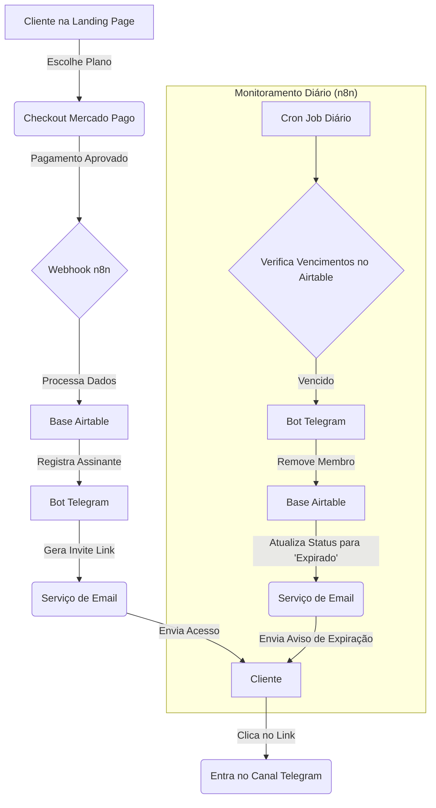

# Arquitetura do Sistema de Assinaturas - CryptoMind Alerts

**Autor:** Manus AI  
**Data:** 18 de Janeiro de 2026

## 1. Visão Geral

Este documento descreve a arquitetura técnica para o sistema automatizado de gerenciamento de assinaturas do canal **CryptoMind Alerts**. O objetivo é criar um fluxo 100% automatizado, desde o pagamento do cliente até o gerenciamento de seu acesso ao canal privado do Telegram, garantindo uma experiência profissional e escalável.

O sistema será construído sobre uma stack de ferramentas robustas e flexíveis, integrando plataformas de pagamento, automação, banco de dados e comunicação.

## 2. Componentes Principais

A arquitetura é composta pelos seguintes componentes principais:

| Componente | Tecnologia | Função |
|---|---|---|
| **Landing Page** | HTML/CSS/JS | Apresentação dos planos e captura de leads (trial). |
| **Gateway de Pagamento** | Mercado Pago | Processamento de pagamentos (Pix, Cartão, Boleto) e assinaturas recorrentes. |
| **Orquestrador** | n8n | Núcleo da automação, responsável por conectar todos os serviços via workflows. |
| **Banco de Dados** | Airtable | Armazenamento e gerenciamento centralizado de assinantes, planos e pagamentos. |
| **Bot Gerenciador** | Telegram Bot API | Adicionar e remover membros do canal privado de forma programática. |
| **Serviço de Email** | (e.g., Gmail/SMTP) | Envio de emails transacionais (boas-vindas, lembretes de vencimento, etc.). |

## 3. Fluxo de Dados e Processos

O diagrama abaixo ilustra o fluxo de ponta a ponta, desde a inscrição do usuário até o gerenciamento contínuo de sua assinatura.

### 3.1. Fluxo de Nova Assinatura

1.  **Captação**: O cliente acessa a Landing Page, escolhe um dos planos (Mensal, Trimestral, Semestral, Anual) e é redirecionado para o link de pagamento correspondente no Mercado Pago.
2.  **Pagamento**: O cliente realiza o pagamento. Após a confirmação, o Mercado Pago dispara um evento de `payment.updated` para um webhook configurado no n8n.
3.  **Processamento**: O workflow do n8n recebe a notificação, valida os dados do pagamento e extrai as informações do cliente (nome, email, plano).
4.  **Registro**: O n8n cria (ou atualiza) um registro na tabela `Assinantes` do Airtable, preenchendo os campos com os dados do pagamento e calculando a `Data_Vencimento`.
5.  **Geração de Acesso**: O n8n utiliza o Bot Gerenciador do Telegram para criar um link de convite único e de uso limitado para o canal privado.
6.  **Entrega**: O n8n envia um email de boas-vindas ao cliente contendo o link de convite e as instruções de acesso.
7.  **Acesso**: O cliente clica no link, entra no canal e passa a receber os alertas.

### 3.2. Fluxo de Gerenciamento de Assinatura (Remoção)

1.  **Verificação Agendada**: Um workflow no n8n é executado diariamente (via Cron Job).
2.  **Consulta**: O workflow consulta a base do Airtable em busca de assinantes cuja `Data_Vencimento` seja a data atual ou anterior e o `Status` seja 'ativo'.
3.  **Remoção**: Para cada assinante vencido encontrado, o n8n utiliza o Bot Gerenciador para remover (banir) o usuário do canal do Telegram.
4.  **Atualização de Status**: O status do assinante no Airtable é atualizado para 'expirado'.
5.  **Notificação**: Um email é enviado ao cliente informando que sua assinatura expirou e oferecendo um link para renovação.

## 4. Considerações de Segurança

- **Chaves de API**: Todas as chaves (n8n, Airtable, Mercado Pago, Telegram) serão armazenadas de forma segura como credenciais criptografadas no n8n.
- **Links de Convite**: Os links de convite do Telegram serão de uso único para evitar compartilhamento não autorizado.
- **Acesso ao Banco de Dados**: O acesso ao Airtable será restrito via API key, utilizada apenas pelo n8n.
